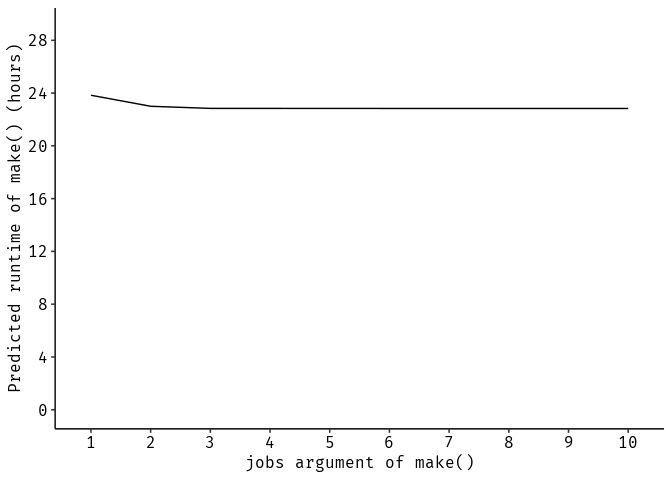

LIFE Healthy Forest
===================

This study was funded by the [EU LIFE Healthy Forest (LIFE14 ENV/ES/000179)](http://ec.europa.eu/environment/life/project/Projects/index.cfm?fuseaction=search.dspPage&n_proj_id=5219) project.

The setup of this benchmark study is described below. In total, 140 performance estimates have been calculated.

#### Classifiers (7)

-   BRT (Boosted Regression Trees)
-   GAM (Generalized Additive Model)
-   GLM (Generalized Linear Model)
-   KNN (k-nearest Neighbor)
-   SVM (Support Vector Machine)
-   RF (Random Forest)
-   XGBOOST (Extreme Gradient Boosting)

#### Datasets (4)

-   Armillaria
-   Diplodia
-   Fusarium
-   Heterobasidion

#### Resampling structures (5)

(performance estimation / hyperparameter tuning)

-   Spatial/non-spatial
-   Spatial/Spatial
-   Spatial/No tuning
-   Non-spatial/Non-spatial
-   Non-spatial/No tuning

Hyperparameter tuning
---------------------

Sequential model-based optimization (SMBO)

Initial design: 30 settings Maximum iterations: 100

Resampling
----------

Nested cross-validation with five folds in both levels and 100 repetitions (performance level).

Performance measure
-------------------

Brier score

Prediction
----------

Probability of occurence for the specific pathogen across the whole Basque country on a 200 x 200 m spatial resolution.

#### External library requirements

-   SAGA GIS (for creating the input variable `slope_degrees`)

Data
----

Stored at [Mendeley Data](http://dx.doi.org/10.17632/kmy95t22fy.1). Data **(~ 4 GB)** will be downloaded into `data/` and processed when executing the project. Local storage directory is "./data".

Workflow
--------

This project is setup with a [drake workflow](https://github.com/ropensci/drake), ensuring reproducibility. Intermediate targets/objects will be stored in a hidden `.drake` directory.

The R library of this project is managed by [packrat](https://rstudio.github.io/packrat/). This makes sure that the exact same package versions are used when recreating the project. When calling `packrat::restore()`, all required packages will be installed with their specific version.

Please note that this project was built with R version 3.5.1 on a Debian 9 operating system. The packrat packages from this project **are not compatible with R versions prior version 3.5.0.** For reproducibility, it is recommended to replicate the analysis using the included Dockerfile. Instructions can be found [ħere](https://github.com/pat-s/pathogen-modeling#docker). (In general, it should be possible to reproduce the analysis on any other operating system.)

To clone the project, a working installation of `git` is required. Open a terminal in the directory of your choice and execute:

``` sh
git clone git@github.com:pat-s/pathogen-modeling.git
```

Then start R in this directory and run

``` r
packrat::restore()
source("code/drake.R")
make(plan, keep_going = TRUE, console_log_file = stdout()) 
# use more cores with make(plan, jobs = <number of cores>)
```

Runtime
-------

Predicted total runtime (based on all target runtimes ever built and stored in the internal `config` file)

``` r
source("code/drake.R")
predict_runtime(config, from_scratch = TRUE, targets_only = TRUE)
```

    ## Warning: Some targets were never actually timed, And no hypothetical time was specified in `known_times`. Assuming a runtime of 0 for these targets:
    ##   lrn_xgboost
    ##   lrn_kknn
    ##   lrn_brt
    ##   lrn_gam_diplodia_perf
    ##   lrn_gam_diplodia_pred
    ##   lrn_gam_fusarium_perf
    ##   lrn_gam_fusarium_pred
    ##   lrn_gam_armillaria_perf
    ##   lrn_gam_armillaria_pred
    ##   lrn_gam_heterobasidion_perf
    ##   lrn_gam_heterobasidion_pred
    ##   lrn_gam_diplodia_perf_non
    ##   lrn_gam_fusarium_perf_non
    ##   lrn_gam_armillaria_perf_non
    ##   lrn_gam_heterobasidion_perf_non
    ##   cv_inner_fiveF
    ##   ps_xgboost
    ##   ps_kknn
    ##   ps_brt
    ##   ps_gam
    ##   tune_ctrl_kknn_100
    ##   tune_ctrl_xgboost_100
    ##   tune_ctrl_brt_100
    ##   tune_ctrl_gam_100
    ##   wrapper_xgboost_sp
    ##   wrapper_brt_sp
    ##   wrapper_kknn_sp
    ##   wrapper_gam_diplodia_perf_sp
    ##   wrapper_gam_fusarium_perf_sp
    ##   ...

    ## [1] "85798.748s (~23.83 hours)"

Acceleration when parallelizing the `make()` call

``` r
time <- c()
for (jobs in 1:10){
  time[jobs] <- predict_runtime(
    drake_config(),
    jobs = jobs,
    from_scratch = TRUE,
    known_times = build_times(targets_only = TRUE)$elapsed
  )
}

library(ggplot2)
ggplot(data.frame(time = time / 3600, jobs = ordered(1:10), group = 1)) +
  geom_line(aes(x = jobs, y = time, group = group)) +
  scale_y_continuous(breaks = 0:10 * 4, limits = c(0, 29)) +
  ggpubr::theme_pubr() +
  xlab("jobs argument of make()") +
  ylab("Predicted runtime of make() (hours)")
```



Docker
------

A Dockerfile is available in `docker/`. It was generated by the R package [`containerit`](https://github.com/o2r-project/containerit) and contains all packrat packages and system libraries with have been used to run the analysis (the file already exists, no need to do this).

``` r
remotes::install_github("pat-s/containerit@packrat")
library(containerit)
container = dockerfile(".", packrat = TRUE)
write(container, "docker/Dockerfile")
```

A docker container can be built and started from this Dockerfile by executing `docker build -t image .` within the `./docker` directory.

Next, the analysis can be started by calling

``` r
source("code/drake.R")
make(plan, keep_going = TRUE, console_log_file = stdout()) 
```

Dependency graphs
-----------------

The dependency graph of this analysis can be visualized with the following code. The grouping via the `"stage"` variable is subjective.

The following groups exist:

-   data
-   learner
-   mlr\_settings
-   benchmark
-   prediction

<!-- -->

    ## Status: Mon Dec 17 00:26:58 2018

``` r
vis_drake_graph(config, group = "stage", clusters = c("data", "prediction", "learner",
                                                      "mlr_settings", "benchmark",
                                                      "prediction"),
                targets_only = TRUE, show_output_files = FALSE,
                navigationButtons = FALSE, selfcontained = TRUE,
                file = "drake.png") +
  ggpubr::theme_pubr()
```


All outdated targets:

``` r
outdated(config)
```

    ##  [1] "benchmark_evaluation_report"        
    ##  [2] "bm_nsp_non_brt"                     
    ##  [3] "bm_nsp_non_gam_armillaria"          
    ##  [4] "bm_nsp_non_gam_diplodia"            
    ##  [5] "bm_nsp_non_gam_fusarium"            
    ##  [6] "bm_nsp_non_gam_heterobasidion"      
    ##  [7] "bm_nsp_non_glm"                     
    ##  [8] "bm_nsp_non_kknn"                    
    ##  [9] "bm_nsp_non_rf"                      
    ## [10] "bm_nsp_non_svm"                     
    ## [11] "bm_nsp_non_xgboost"                 
    ## [12] "bm_nsp_nsp_brt"                     
    ## [13] "bm_nsp_nsp_gam_armillaria"          
    ## [14] "bm_nsp_nsp_gam_diplodia"            
    ## [15] "bm_nsp_nsp_gam_fusarium"            
    ## [16] "bm_nsp_nsp_gam_heterobasidion"      
    ## [17] "bm_nsp_nsp_kknn"                    
    ## [18] "bm_nsp_nsp_rf"                      
    ## [19] "bm_nsp_nsp_svm"                     
    ## [20] "bm_nsp_nsp_xgboost"                 
    ## [21] "bm_sp_non_brt"                      
    ## [22] "bm_sp_non_gam_armillaria"           
    ## [23] "bm_sp_non_gam_diplodia"             
    ## [24] "bm_sp_non_gam_fusarium"             
    ## [25] "bm_sp_non_gam_heterobasidion"       
    ## [26] "bm_sp_non_glm"                      
    ## [27] "bm_sp_non_kknn"                     
    ## [28] "bm_sp_non_rf"                       
    ## [29] "bm_sp_non_svm"                      
    ## [30] "bm_sp_non_xgboost"                  
    ## [31] "bm_sp_nsp_brt"                      
    ## [32] "bm_sp_nsp_gam_armillaria"           
    ## [33] "bm_sp_nsp_gam_diplodia"             
    ## [34] "bm_sp_nsp_gam_fusarium"             
    ## [35] "bm_sp_nsp_gam_heterobasidion"       
    ## [36] "bm_sp_nsp_kknn"                     
    ## [37] "bm_sp_nsp_rf"                       
    ## [38] "bm_sp_nsp_svm"                      
    ## [39] "bm_sp_nsp_xgboost"                  
    ## [40] "bm_sp_sp_brt"                       
    ## [41] "bm_sp_sp_gam_armillaria_sp"         
    ## [42] "bm_sp_sp_gam_diplodia_sp"           
    ## [43] "bm_sp_sp_gam_fusarium_sp"           
    ## [44] "bm_sp_sp_gam_heterobasidion_sp"     
    ## [45] "bm_sp_sp_kknn"                      
    ## [46] "bm_sp_sp_rf"                        
    ## [47] "bm_sp_sp_svm"                       
    ## [48] "bm_sp_sp_xgboost"                   
    ## [49] "cv_inner_fiveF"                     
    ## [50] "lrn_brt"                            
    ## [51] "lrn_gam_armillaria_perf"            
    ## [52] "lrn_gam_armillaria_perf_non"        
    ## [53] "lrn_gam_armillaria_pred"            
    ## [54] "lrn_gam_diplodia_perf"              
    ## [55] "lrn_gam_diplodia_perf_non"          
    ## [56] "lrn_gam_diplodia_pred"              
    ## [57] "lrn_gam_fusarium_perf"              
    ## [58] "lrn_gam_fusarium_perf_non"          
    ## [59] "lrn_gam_fusarium_pred"              
    ## [60] "lrn_gam_heterobasidion_perf"        
    ## [61] "lrn_gam_heterobasidion_perf_non"    
    ## [62] "lrn_gam_heterobasidion_pred"        
    ## [63] "lrn_kknn"                           
    ## [64] "lrn_xgboost"                        
    ## [65] "pred_data"                          
    ## [66] "prediction_gam_armillaria"          
    ## [67] "prediction_gam_diplodia"            
    ## [68] "prediction_gam_fusarium"            
    ## [69] "prediction_gam_heterobasidion"      
    ## [70] "prediction_glm"                     
    ## [71] "prediction_kknn"                    
    ## [72] "prediction_rf"                      
    ## [73] "prediction_svm"                     
    ## [74] "prediction_xgboost"                 
    ## [75] "ps_brt"                             
    ## [76] "ps_gam"                             
    ## [77] "ps_kknn"                            
    ## [78] "ps_xgboost"                         
    ## [79] "tune_ctrl_brt_100"                  
    ## [80] "tune_ctrl_gam_100"                  
    ## [81] "tune_ctrl_kknn_100"                 
    ## [82] "tune_ctrl_xgboost_100"              
    ## [83] "wrapper_brt_nsp"                    
    ## [84] "wrapper_brt_sp"                     
    ## [85] "wrapper_gam_armillaria_perf_nsp"    
    ## [86] "wrapper_gam_armillaria_perf_sp"     
    ## [87] "wrapper_gam_diplodia_perf_nsp"      
    ## [88] "wrapper_gam_diplodia_perf_sp"       
    ## [89] "wrapper_gam_fusarium_perf_nsp"      
    ## [90] "wrapper_gam_fusarium_perf_sp"       
    ## [91] "wrapper_gam_heterobasidion_perf_nsp"
    ## [92] "wrapper_gam_heterobasidion_perf_sp" 
    ## [93] "wrapper_kknn_nsp"                   
    ## [94] "wrapper_kknn_sp"                    
    ## [95] "wrapper_rf_nsp"                     
    ## [96] "wrapper_svm_nsp"                    
    ## [97] "wrapper_xgboost_nsp"                
    ## [98] "wrapper_xgboost_sp"

If all intermediate objects should be visualized (not recommended):

``` r
vis_drake_graph(config) + ggpubr::theme_pubr()
```
