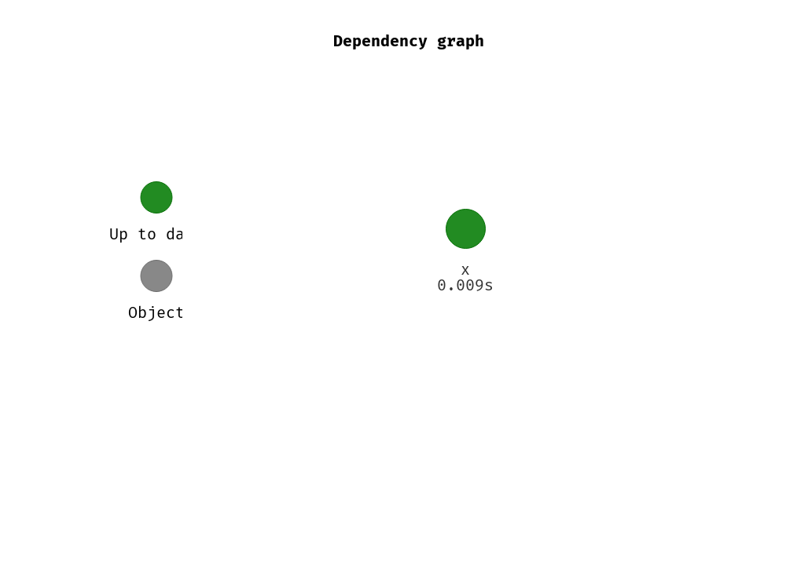

# LIFE Healthy Forest

Benchmarking classifiers (SVM, RF, XGBOOST) on four different pathogens:

* Armillaria
* Diplodia
* Heterobasidion
* Fusarium

Hyperparameter tuning: Sequential model-based optimization (SMBO)

This project is setup with a [drake workflow](https://github.com/ropensci/drake), ensuring reproducibility.
The complete project can be run in any R installation by executing the following:

```r
install.packages(c("needs", "drake", "git2r"))
git2r::clone("url")

source("scripts/drake.R")
make(plan)
```

The dependency graph (subjective grouping) can be visualized using

```r
vis_drake_graph(config, group = "stage", clusters = c("task", "learner",
                                                      "mlr_settings",
                                                      "benchmark",
                                                      "prediction"),
                targets_only = TRUE, show_output_files = FALSE)
```



If all required objects should be visualized (not recommended):

```r
vis_drake_graph(config)
```


Options for deployment:

- [clustermq](https://github.com/mschubert/clustermq) uses [zmq](http://zeromq.org/) with the following schedulers: LSF, SGE, SLURM. See [here](https://github.com/mschubert/clustermq/wiki/Comparison-to-other-packages) for more info.

HPC:

Configuration: 
- [warewulf](http://warewulf.lbl.gov): Installer not working, 404 errors when downloading source...)
- [xCat](https://xcat-docs.readthedocs.io/en/stable/): No Debian support
- [OSCAR](http://svn.oscar.openclustergroup.org/trac/oscar): Last updated 2011?
- [oneSIS](http://onesis.org/): 5 commits in the last 2 years...
- [openHPC](https://en.wikipedia.org/wiki/OpenHPC): centOS and Suse onlycore

Monitoring tool: [Ganglia](http://ganglia.sourceforge.net/)
