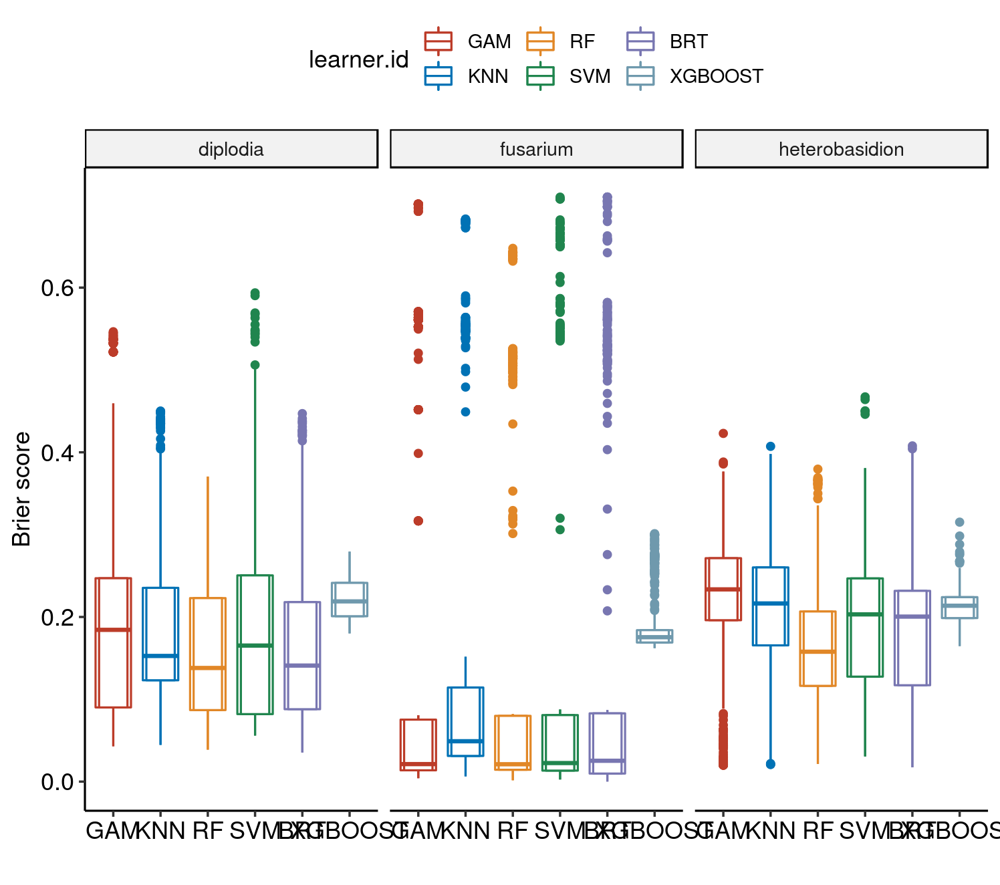
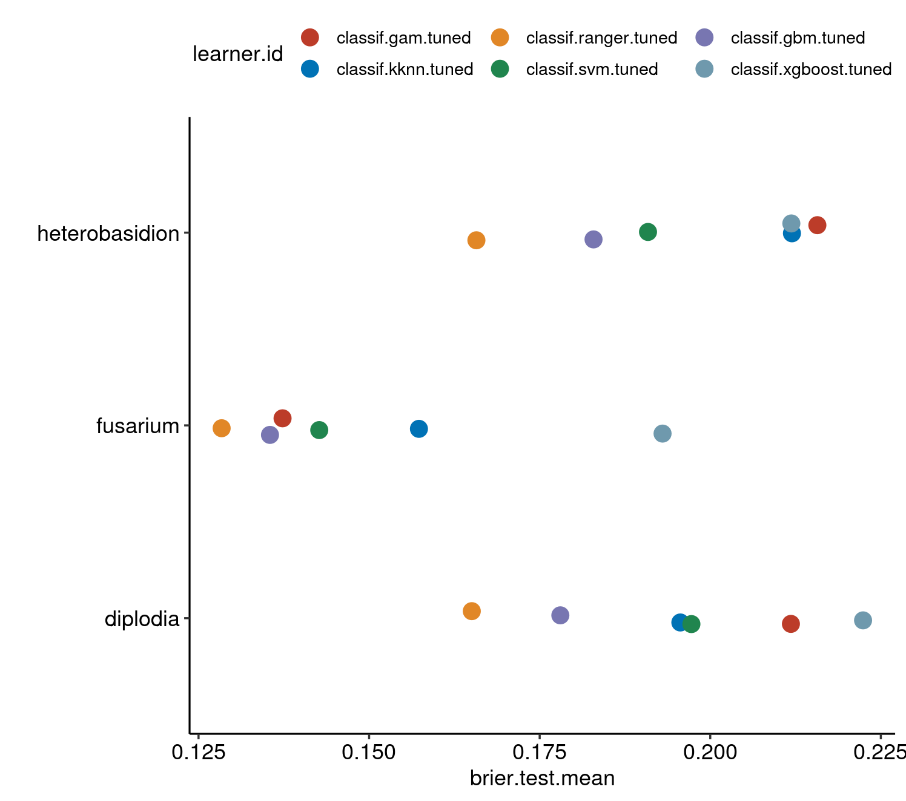
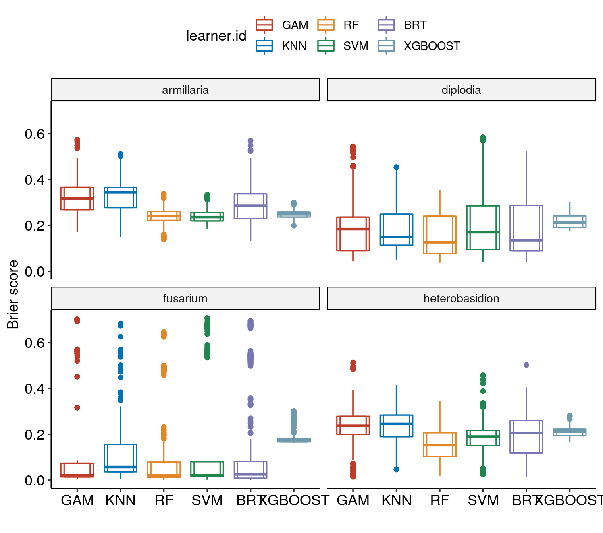
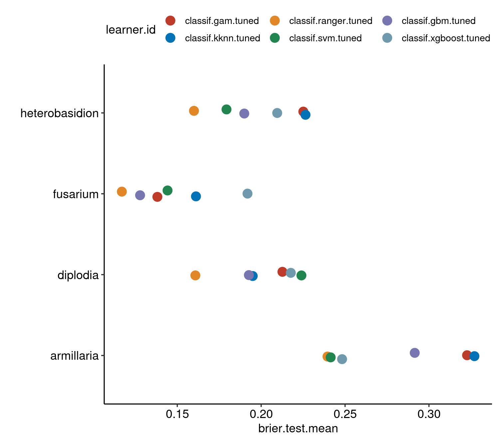
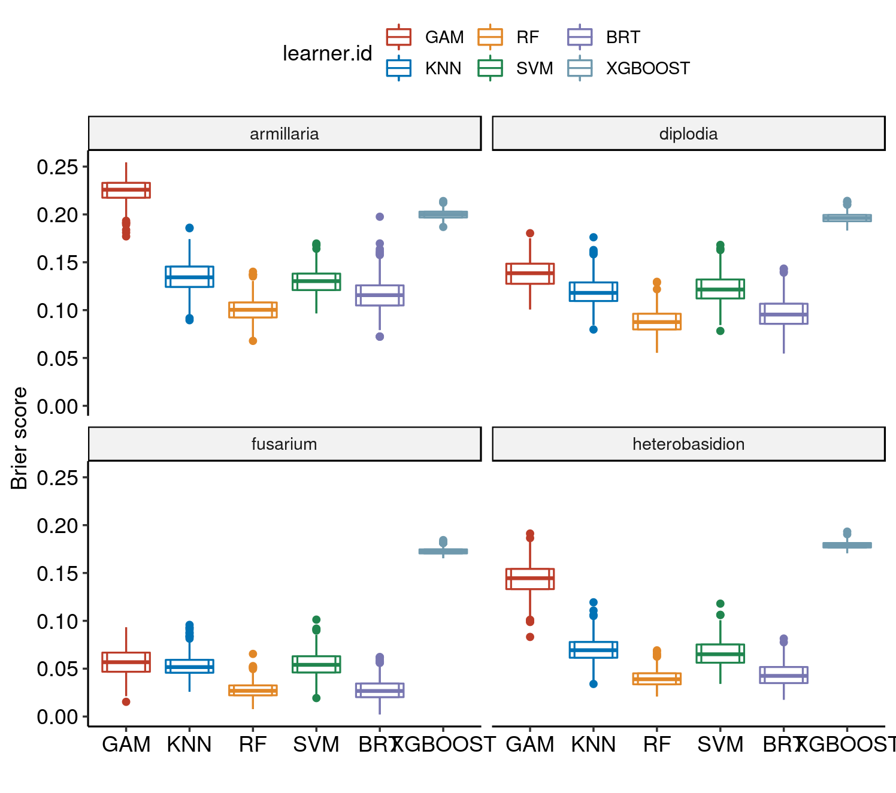
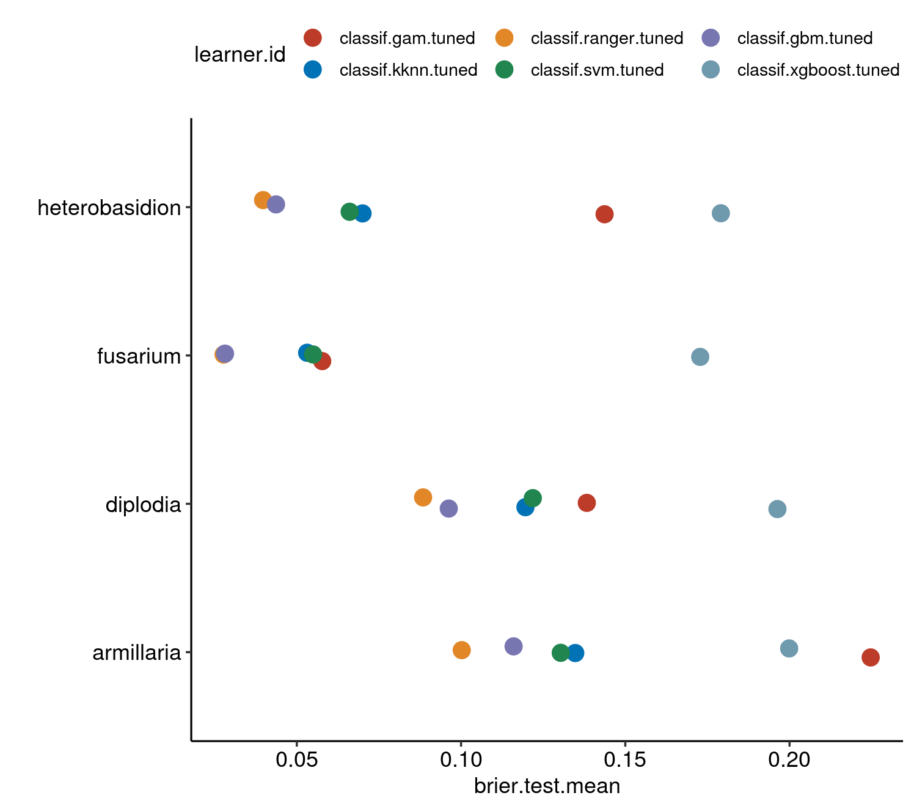
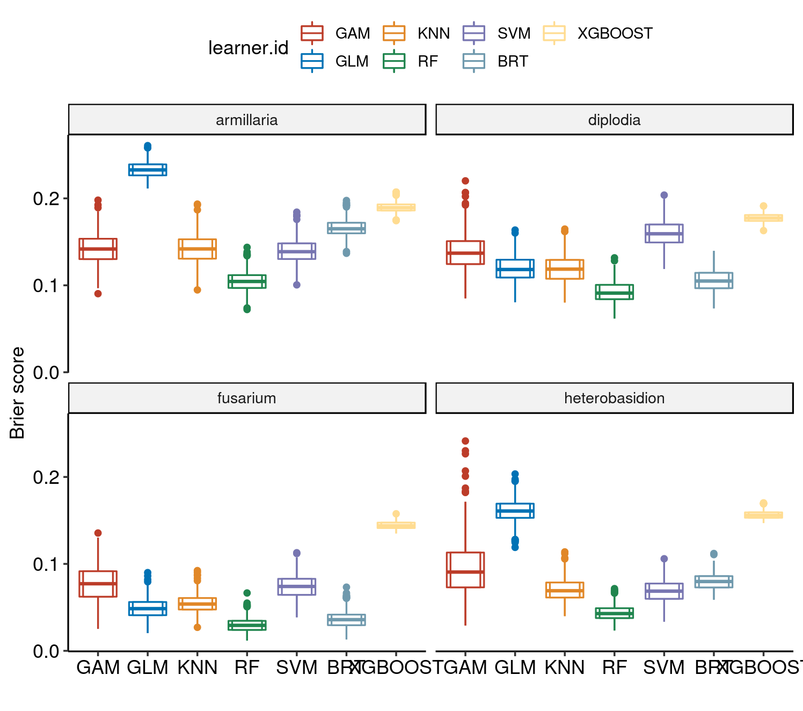
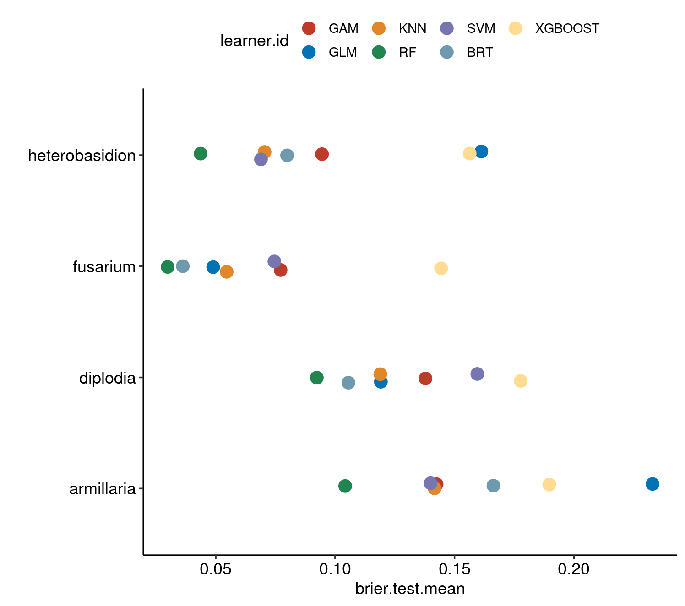
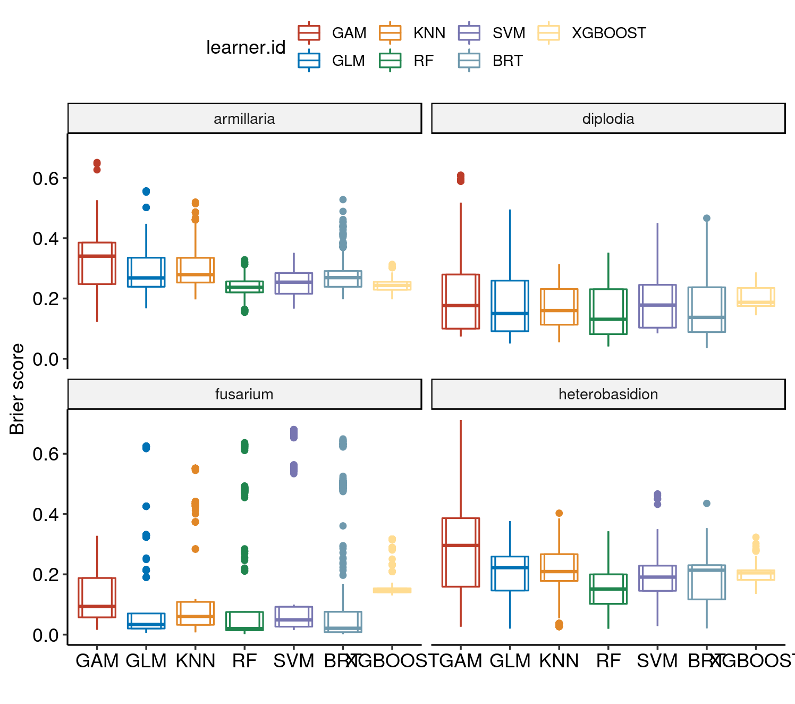
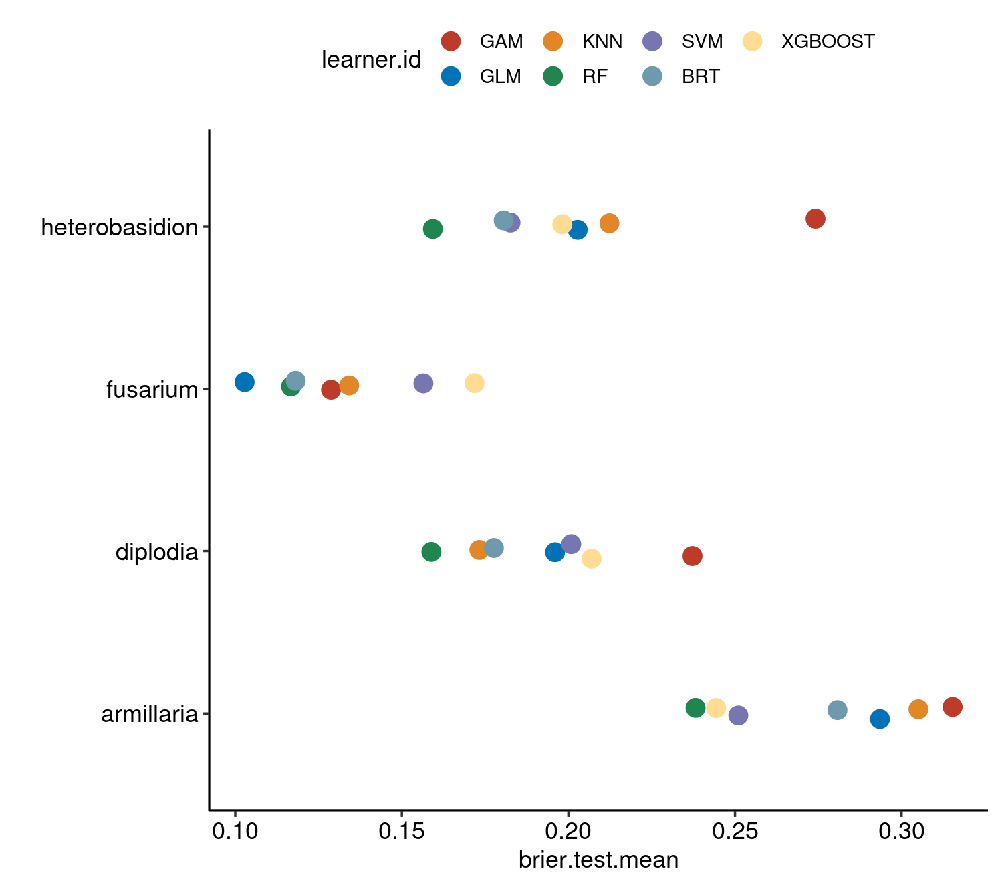

This report evaluates the performance of the algorithms 

* _Boosted Regression Trees_ (BRT), 
* _Random Forest_ (RF), 
* _Support Vector Machine_ (SVM) 
* _Extreme Gradient Boosting_ (xgboost) 
* _Generalized Linear Model_ (GLM) 
* _Generalized Additive Model_ (GAM) 
* _k-Nearest Neighbor_ (KNN)

on four different pathogens:

- _Armillaria mellea_
- _Diplodia sapinea_
- _Fusarium mellea_
- _Heterobasidion mellea_


Models that did not converge:

- Armillaria: XGBOOST (sp/sp)
- Armillaria: GAM     (sp/sp)

# Resampling strategies {.tabset .tabset-fade}

## Spatial-Spatial


```r
bm_all_pathogens_sp_sp %>%
  getBMRAggrPerformances(as.df = TRUE) %>% 
  arrange(task.id, desc(brier.test.mean))
```

```
##           task.id            learner.id brier.test.mean
## 1        diplodia classif.xgboost.tuned       0.2223977
## 2        diplodia     classif.gam.tuned       0.2118220
## 3        diplodia     classif.svm.tuned       0.1972381
## 4        diplodia    classif.kknn.tuned       0.1956182
## 5        diplodia     classif.gbm.tuned       0.1780292
## 6        diplodia  classif.ranger.tuned       0.1650495
## 7        fusarium classif.xgboost.tuned       0.1930103
## 8        fusarium    classif.kknn.tuned       0.1573031
## 9        fusarium     classif.svm.tuned       0.1426939
## 10       fusarium     classif.gam.tuned       0.1373138
## 11       fusarium     classif.gbm.tuned       0.1354728
## 12       fusarium  classif.ranger.tuned       0.1283875
## 13 heterobasidion     classif.gam.tuned       0.2157003
## 14 heterobasidion    classif.kknn.tuned       0.2119746
## 15 heterobasidion classif.xgboost.tuned       0.2118857
## 16 heterobasidion     classif.svm.tuned       0.1908778
## 17 heterobasidion     classif.gbm.tuned       0.1828938
## 18 heterobasidion  classif.ranger.tuned       0.1657267
##    timetrain.test.mean
## 1            926.28370
## 2            172.89070
## 3            121.73020
## 4             89.70170
## 5            914.83904
## 6            152.30163
## 7            715.88053
## 8             89.23967
## 9             98.26001
## 10           177.54682
## 11          1229.79645
## 12           130.69985
## 13           147.98625
## 14            83.88350
## 15           816.28244
## 16           123.99573
## 17           999.13126
## 18           128.88789
```

### Visualize


```r
plt = plotBMRBoxplots(bm_all_pathogens_sp_sp, measure = brier, pretty.names = F, 
                      order.lrn = c("classif.gam.tuned", "classif.kknn.tuned",
                                    "classif.ranger.tuned",
                                    "classif.svm.tuned" , "classif.gbm.tuned",
                                    "classif.xgboost.tuned")) +
  #order.lrn = getBMRLearnerIds(bm_all_pathogens_sp_sp)) + # gam again duplicated -.-
  aes(color = learner.id) +
  geom_boxplot(width = 0.6, outlier.size = 0.3, outlier.shape = 19) +
  scale_colour_nejm() +
  labs(y = "Brier score", x = "") + 
  # scale_color_viridis_d() +
  theme(strip.text.x = element_text(size = 8)) + 
  theme_pubr()

#levels(plt$data$task.id) = c("Diplodia")
levels(plt$data$learner.id) = c("GAM", "KNN", "RF", "SVM", "BRT", "XGBOOST")

plt
```



### Aggregated performances


```r
plt2 = plotBMRSummary(bm_all_pathogens_sp_sp, pretty.names = FALSE) + 
  scale_colour_nejm() +
  theme_pubr()

#levels(plt2$data$task.id) = c("Diplodia")
levels(plt$data$learner.id) = c("GAM", "KNN", "RF", "SVM", "BRT", "XGBOOST")

plt2
```



## Spatial-Non-Spatial


```r
bm_all_pathogens_sp_nsp %>%
  getBMRAggrPerformances(as.df = TRUE) %>% 
  arrange(task.id, desc(brier.test.mean))
```

```
##           task.id            learner.id brier.test.mean
## 1      armillaria    classif.kknn.tuned       0.3270912
## 2      armillaria     classif.gam.tuned       0.3227247
## 3      armillaria     classif.gbm.tuned       0.2915257
## 4      armillaria classif.xgboost.tuned       0.2482235
## 5      armillaria     classif.svm.tuned       0.2414270
## 6      armillaria  classif.ranger.tuned       0.2395426
## 7        diplodia     classif.svm.tuned       0.2239936
## 8        diplodia classif.xgboost.tuned       0.2176628
## 9        diplodia     classif.gam.tuned       0.2126723
## 10       diplodia    classif.kknn.tuned       0.1949616
## 11       diplodia     classif.gbm.tuned       0.1926850
## 12       diplodia  classif.ranger.tuned       0.1607841
## 13       fusarium classif.xgboost.tuned       0.1918548
## 14       fusarium    classif.kknn.tuned       0.1611429
## 15       fusarium     classif.svm.tuned       0.1442020
## 16       fusarium     classif.gam.tuned       0.1381429
## 17       fusarium     classif.gbm.tuned       0.1278374
## 18       fusarium  classif.ranger.tuned       0.1169586
## 19 heterobasidion    classif.kknn.tuned       0.2264248
## 20 heterobasidion     classif.gam.tuned       0.2251266
## 21 heterobasidion classif.xgboost.tuned       0.2095635
## 22 heterobasidion     classif.gbm.tuned       0.1899308
## 23 heterobasidion     classif.svm.tuned       0.1793335
## 24 heterobasidion  classif.ranger.tuned       0.1599481
##    timetrain.test.mean
## 1             85.53943
## 2            147.36127
## 3           1353.07902
## 4           1111.70393
## 5            137.97026
## 6            218.33032
## 7            193.13660
## 8           1023.47379
## 9            166.71188
## 10            91.24430
## 11          1415.88988
## 12           213.89695
## 13           750.15063
## 14            90.43071
## 15           105.20960
## 16           179.70380
## 17          1536.52044
## 18           156.06088
## 19            85.59007
## 20           147.88502
## 21           895.26899
## 22          1636.11106
## 23           128.31889
## 24           170.81731
```

### Visualize


```r
plt = plotBMRBoxplots(bm_all_pathogens_sp_nsp, measure = brier, pretty.names = F, 
                      order.lrn = c("classif.gam.tuned", "classif.kknn.tuned",
                                    "classif.ranger.tuned",
                                    "classif.svm.tuned" , "classif.gbm.tuned",
                                    "classif.xgboost.tuned")) +
  #order.lrn = getBMRLearnerIds(bm_all_pathogens_sp_sp)) + # gam again duplicated -.-
  aes(color = learner.id) +
  geom_boxplot(width = 0.6, outlier.size = 0.3, outlier.shape = 19) +
  scale_colour_nejm() +
  labs(y = "Brier score", x = "") + 
  # scale_color_viridis_d() +
  theme(strip.text.x = element_text(size = 8)) + 
  theme_pubr()

#levels(plt$data$task.id) = c("Diplodia")
levels(plt$data$learner.id) = c("GAM", "KNN", "RF", "SVM", "BRT", "XGBOOST")

plt
```



### Aggregated performances


```r
plt2 = plotBMRSummary(bm_all_pathogens_sp_nsp, pretty.names = FALSE) + 
  scale_colour_nejm() +
  theme_pubr()

#levels(plt2$data$task.id) = c("Diplodia")
levels(plt2$data$learner.id) = c("GAM", "KNN", "RF", "SVM", "BRT")
```

```
## Error in `levels<-.factor`(`*tmp*`, value = c("GAM", "KNN", "RF", "SVM", : number of levels differs
```

```r
plt2
```



## Non-Spatial-Non-Spatial


```r
bm_all_pathogens_nsp_nsp %>%
  getBMRAggrPerformances(as.df = TRUE) %>% 
  arrange(task.id, desc(brier.test.mean))
```

```
##           task.id            learner.id brier.test.mean
## 1      armillaria     classif.gam.tuned      0.22470562
## 2      armillaria classif.xgboost.tuned      0.19988354
## 3      armillaria    classif.kknn.tuned      0.13476405
## 4      armillaria     classif.svm.tuned      0.13034958
## 5      armillaria     classif.gbm.tuned      0.11599695
## 6      armillaria  classif.ranger.tuned      0.10020974
## 7        diplodia classif.xgboost.tuned      0.19631575
## 8        diplodia     classif.gam.tuned      0.13828131
## 9        diplodia     classif.svm.tuned      0.12183801
## 10       diplodia    classif.kknn.tuned      0.11960121
## 11       diplodia     classif.gbm.tuned      0.09626146
## 12       diplodia  classif.ranger.tuned      0.08844688
## 13       fusarium classif.xgboost.tuned      0.17280562
## 14       fusarium     classif.gam.tuned      0.05773283
## 15       fusarium     classif.svm.tuned      0.05494349
## 16       fusarium    classif.kknn.tuned      0.05315145
## 17       fusarium     classif.gbm.tuned      0.02814927
## 18       fusarium  classif.ranger.tuned      0.02771418
## 19 heterobasidion classif.xgboost.tuned      0.17910151
## 20 heterobasidion     classif.gam.tuned      0.14369552
## 21 heterobasidion    classif.kknn.tuned      0.07001242
## 22 heterobasidion     classif.svm.tuned      0.06608569
## 23 heterobasidion     classif.gbm.tuned      0.04366813
## 24 heterobasidion  classif.ranger.tuned      0.03974149
##    timetrain.test.mean
## 1            150.32062
## 2           1131.76400
## 3             86.57693
## 4            142.86293
## 5           1324.94651
## 6            225.62927
## 7           1044.37612
## 8            168.40803
## 9            198.81407
## 10            90.90356
## 11          1265.36845
## 12           222.10920
## 13           768.25944
## 14           173.69480
## 15            97.75530
## 16            90.38798
## 17          1562.80627
## 18           158.61889
## 19           916.70034
## 20           149.23387
## 21            86.32215
## 22           134.17752
## 23          1681.02936
## 24           179.05643
```

### Visualize


```r
plt = plotBMRBoxplots(bm_all_pathogens_nsp_nsp, measure = brier, pretty.names = F, 
                      order.lrn = c("classif.gam.tuned", "classif.kknn.tuned",
                                    "classif.ranger.tuned",
                                    "classif.svm.tuned" , "classif.gbm.tuned",
                                    "classif.xgboost.tuned")) +
  #order.lrn = getBMRLearnerIds(bm_all_pathogens_sp_sp)) + # gam again duplicated -.-
  aes(color = learner.id) +
  geom_boxplot(width = 0.6, outlier.size = 0.3, outlier.shape = 19) +
  scale_colour_nejm() +
  labs(y = "Brier score", x = "") + 
  # scale_color_viridis_d() +
  theme(strip.text.x = element_text(size = 8)) + 
  theme_pubr()

#levels(plt$data$task.id) = c("Diplodia")
levels(plt$data$learner.id) = c("GAM", "KNN", "RF", "SVM", "BRT", "XGBOOST")

plt
```



### Aggregated performances


```r
plt2 = plotBMRSummary(bm_all_pathogens_nsp_nsp, pretty.names = FALSE) + 
  scale_colour_nejm() +
  theme_pubr()

#levels(plt2$data$task.id) = c("Diplodia")
levels(plt2$data$learner.id) = c("GAM", "KNN", "RF", "SVM", "BRT")
```

```
## Error in `levels<-.factor`(`*tmp*`, value = c("GAM", "KNN", "RF", "SVM", : number of levels differs
```

```r
plt2
```



## Non-Spatial-No Tuning


```r
bm_all_pathogens_nsp_non %>%
  getBMRAggrPerformances(as.df = TRUE) %>% 
  arrange(task.id, desc(brier.test.mean))
```

```
##           task.id       learner.id brier.test.mean timetrain.test.mean
## 1      armillaria classif.binomial      0.23292974            0.144510
## 2      armillaria  classif.xgboost      0.18963637            1.068238
## 3      armillaria      classif.gbm      0.16629378            0.133606
## 4      armillaria      classif.gam      0.14250881            0.568456
## 5      armillaria     classif.kknn      0.14164183            0.003894
## 6      armillaria      classif.svm      0.13997486            0.456014
## 7      armillaria   classif.ranger      0.10422809            0.727516
## 8        diplodia  classif.xgboost      0.17769629            0.415642
## 9        diplodia      classif.svm      0.15953720            0.247544
## 10       diplodia      classif.gam      0.13784101            0.248172
## 11       diplodia classif.binomial      0.11916360            0.021568
## 12       diplodia     classif.kknn      0.11893981            0.000880
## 13       diplodia      classif.gbm      0.10556276            0.051542
## 14       diplodia   classif.ranger      0.09234835            0.251736
## 15       fusarium  classif.xgboost      0.14439302            0.102764
## 16       fusarium      classif.gam      0.07716688            0.348294
## 17       fusarium      classif.svm      0.07454755            0.240502
## 18       fusarium     classif.kknn      0.05459185            0.000494
## 19       fusarium classif.binomial      0.04893514            0.024454
## 20       fusarium      classif.gbm      0.03621696            0.050936
## 21       fusarium   classif.ranger      0.02984426            0.169444
## 22 heterobasidion classif.binomial      0.16126069            0.060172
## 23 heterobasidion  classif.xgboost      0.15635915            1.123374
## 24 heterobasidion      classif.gam      0.09450596            0.590578
## 25 heterobasidion      classif.gbm      0.07987779            0.078728
## 26 heterobasidion     classif.kknn      0.07047565            0.001740
## 27 heterobasidion      classif.svm      0.06895227            0.310736
## 28 heterobasidion   classif.ranger      0.04366729            0.325412
```

### Visualize


```r
plt = plotBMRBoxplots(bm_all_pathogens_nsp_non, measure = brier, pretty.names = F, 
                      order.lrn = c("classif.gam", "classif.binomial",
                                    "classif.kknn",
                                    "classif.ranger",
                                    "classif.svm", "classif.gbm",
                                    "classif.xgboost")) +
  #order.lrn = getBMRLearnerIds(bm_all_pathogens_sp_sp)) + # gam again duplicated -.-
  aes(color = learner.id) +
  geom_boxplot(width = 0.6, outlier.size = 0.3, outlier.shape = 19) +
  scale_colour_nejm() +
  labs(y = "Brier score", x = "") + 
  # scale_color_viridis_d() +
  theme(strip.text.x = element_text(size = 8)) + 
  theme_pubr()

#levels(plt$data$task.id) = c("Diplodia")
levels(plt$data$learner.id) = c("GAM", "GLM", "KNN", "RF", "SVM", "BRT", "XGBOOST")

plt
```



### Aggregated performances


```r
plt2 = plotBMRSummary(bm_all_pathogens_nsp_non, pretty.names = FALSE) + 
  scale_colour_nejm() +
  theme_pubr()

#levels(plt2$data$task.id) = c("Diplodia")
levels(plt2$data$learner.id) = c("GAM", "GLM", "KNN", "RF", "SVM", "BRT", "XGBOOST")

plt2
```



## Spatial-No Tuning


```r
bm_all_pathogens_sp_non %>%
  getBMRAggrPerformances(as.df = TRUE) %>% 
  arrange(task.id, desc(brier.test.mean))
```

```
##           task.id       learner.id brier.test.mean timetrain.test.mean
## 1      armillaria      classif.gam       0.3153256            0.665194
## 2      armillaria     classif.kknn       0.3050645            0.001866
## 3      armillaria classif.binomial       0.2935126            0.076862
## 4      armillaria      classif.gbm       0.2807682            0.073266
## 5      armillaria      classif.svm       0.2510060            0.302472
## 6      armillaria  classif.xgboost       0.2443365            1.021456
## 7      armillaria   classif.ranger       0.2381671            0.545020
## 8        diplodia      classif.gam       0.2372448            0.248700
## 9        diplodia  classif.xgboost       0.2069464            0.443152
## 10       diplodia      classif.svm       0.2008383            0.240998
## 11       diplodia classif.binomial       0.1959824            0.019416
## 12       diplodia      classif.gbm       0.1776288            0.050382
## 13       diplodia     classif.kknn       0.1732633            0.000854
## 14       diplodia   classif.ranger       0.1588658            0.246136
## 15       fusarium  classif.xgboost       0.1718123            0.105188
## 16       fusarium      classif.svm       0.1564700            0.231202
## 17       fusarium     classif.kknn       0.1341897            0.000580
## 18       fusarium      classif.gam       0.1287344            0.339390
## 19       fusarium      classif.gbm       0.1181421            0.051066
## 20       fusarium   classif.ranger       0.1167445            0.162094
## 21       fusarium classif.binomial       0.1028080            0.025796
## 22 heterobasidion      classif.gam       0.2741802            0.705316
## 23 heterobasidion     classif.kknn       0.2123064            0.002064
## 24 heterobasidion classif.binomial       0.2027726            0.061314
## 25 heterobasidion  classif.xgboost       0.1981751            1.112480
## 26 heterobasidion      classif.svm       0.1826196            0.293056
## 27 heterobasidion      classif.gbm       0.1805687            0.078990
## 28 heterobasidion   classif.ranger       0.1593167            0.309814
```

### Visualize


```r
plt = plotBMRBoxplots(bm_all_pathogens_sp_non, measure = brier, pretty.names = F, 
                      order.lrn = c("classif.gam", "classif.binomial",
                                    "classif.kknn",
                                    "classif.ranger",
                                    "classif.svm", "classif.gbm",
                                    "classif.xgboost"))  +
  #order.lrn = getBMRLearnerIds(bm_all_pathogens_sp_sp)) + # gam again duplicated -.-
  aes(color = learner.id) +
  geom_boxplot(width = 0.6, outlier.size = 0.3, outlier.shape = 19) +
  scale_colour_nejm() +
  labs(y = "Brier score", x = "") + 
  # scale_color_viridis_d() +
  theme(strip.text.x = element_text(size = 8)) + 
  theme_pubr()

#levels(plt$data$task.id) = c("Diplodia")
levels(plt$data$learner.id) = c("GAM", "GLM", "KNN", "RF", "SVM", "BRT", "XGBOOST")

plt
```



### Aggregated performances


```r
plt2 = plotBMRSummary(bm_all_pathogens_sp_non, pretty.names = FALSE) + 
  scale_colour_nejm() +
  theme_pubr()

# levels(plt2$data$task.id) = c("Diplodia")
levels(plt2$data$learner.id) = c("GAM", "GLM", "KNN", "RF", "SVM", "BRT", "XGBOOST")

plt2
```


