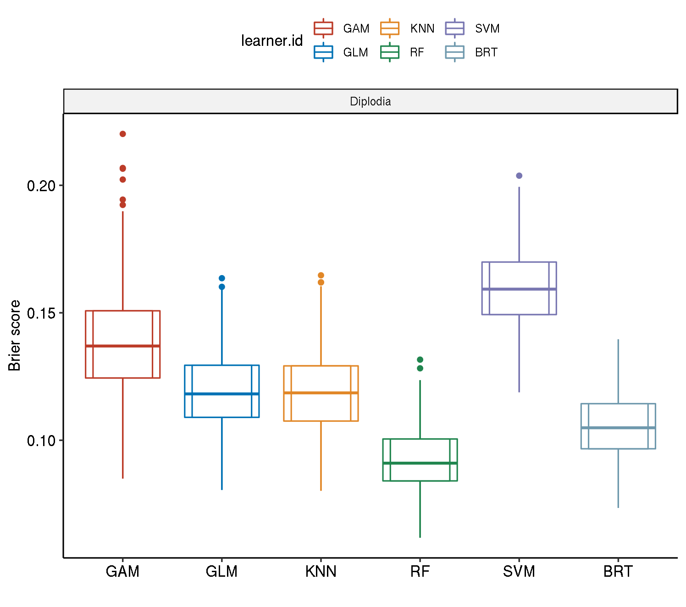
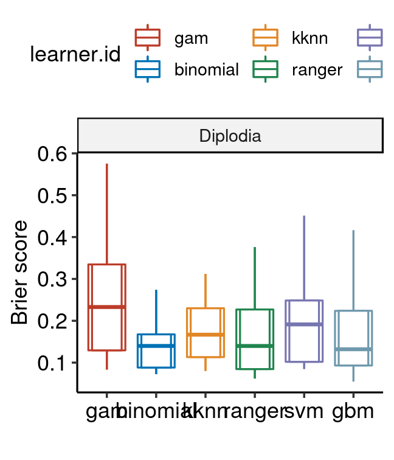
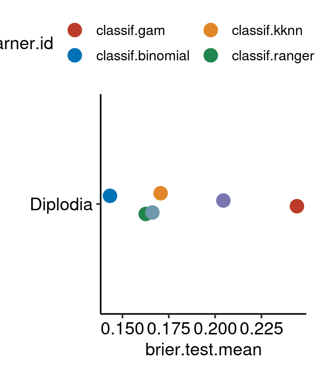

This report evaluates the performance of the algorithms 

* _Boosted Regression Trees_ (BRT), 
* _Random Forest_ (RF), 
* _Support Vector Machine_ (SVM) 
* _Generalized Linear Model_ (GLM) 
* _Generalized Additive Model_ (GAM) 

on the following pathogen:

- _Diplodia sapinea_


Merge benchmark results


```r
bm_sp_sp_diplodia = mergeBenchmarkResults(list(bm_sp_sp_diplodia_gam, 
                                               bm_sp_sp_diplodia_kknn, bm_sp_sp_diplodia_rf,
                                               bm_sp_sp_diplodia_svm, bm_sp_sp_diplodia_brt))
```

```
## Error in clustermq:::worker("tcp://gisc:6438"): Assertion on 'bmrs' failed: May only contain the following types: BenchmarkResult.
```

```r
bm_sp_nsp_diplodia = mergeBenchmarkResults(list(bm_sp_nsp_diplodia_gam,
                                                bm_sp_nsp_diplodia_kknn, bm_sp_nsp_diplodia_rf,
                                                bm_sp_nsp_diplodia_svm, bm_sp_nsp_diplodia_brt))
```

```
## Error in clustermq:::worker("tcp://gisc:6438"): Assertion on 'bmrs' failed: May only contain the following types: BenchmarkResult.
```

```r
bm_nsp_nsp_diplodia = mergeBenchmarkResults(list(bm_nsp_nsp_diplodia_gam,
                                                 bm_nsp_nsp_diplodia_kknn, bm_nsp_nsp_diplodia_rf,
                                                 bm_nsp_nsp_diplodia_svm, bm_nsp_nsp_diplodia_brt))
```

```
## Error in clustermq:::worker("tcp://gisc:6438"): Assertion on 'bmrs' failed: May only contain the following types: BenchmarkResult.
```

```r
bm_sp_non_diplodia = mergeBenchmarkResults(list(bm_sp_non_diplodia_gam, bm_sp_non_diplodia_glm,
                                                bm_sp_non_diplodia_kknn, bm_sp_non_diplodia_rf,
                                                bm_sp_non_diplodia_svm, bm_sp_non_diplodia_brt))

bm_nsp_non_diplodia = mergeBenchmarkResults(list(bm_nsp_non_diplodia_gam, bm_nsp_non_diplodia_glm,
                                                 bm_nsp_non_diplodia_kknn, bm_nsp_non_diplodia_rf,
                                                 bm_nsp_non_diplodia_svm, bm_nsp_non_diplodia_brt))
```


# Resampling strategies {.tabset .tabset-fade}

## Spatial-Spatial


```r
bm_sp_sp_diplodia %>%
  getBMRAggrPerformances(as.df = TRUE) %>% 
  arrange(task.id, desc(brier.test.mean))
```

```
## Error in eval(lhs, parent, parent): object 'bm_sp_sp_diplodia' not found
```

### Visualize


```r
plt = plotBMRBoxplots(bm_sp_sp_diplodia, measure = brier, pretty.names = T, 
                      #order.lrn = c("classif.ranger.tuned", "classif.svm.tuned", "classif.kknn.tuned",
                      #              "classif.gbm.tuned" , "classif.gam.tuned")) +
  order.lrn = getBMRLearnerIds(bm_sp_sp_diplodia)) + # gam again duplicated -.-
  aes(color = learner.id) +
  geom_boxplot(width = 0.6, outlier.size = 0.3, outlier.shape = 19) +
  scale_colour_nejm() +
  labs(y = "Brier score", x = "") + 
  # scale_color_viridis_d() +
  theme(strip.text.x = element_text(size = 8)) + 
  theme_pubr()
```

```
## Error in checkClass(x, classes, ordered, null.ok): object 'bm_sp_sp_diplodia' not found
```

```r
levels(plt$data$task.id) = c("Diplodia")
```

```
## Error in levels(plt$data$task.id) = c("Diplodia"): object 'plt' not found
```

```r
levels(plt$data$learner.id) = c("GAM", "KNN", "RF", "SVM", "BRT")
```

```
## Error in levels(plt$data$learner.id) = c("GAM", "KNN", "RF", "SVM", "BRT"): object 'plt' not found
```

```r
#plt + ylab("Performance")
plt
```

```
## Error in eval(expr, envir, enclos): object 'plt' not found
```

### Aggregated performances


```r
plt2 = plotBMRSummary(bm_sp_sp_diplodia, pretty.names = FALSE) + 
  scale_colour_nejm() +
  theme_pubr()
```

```
## Error in checkClass(x, classes, ordered, null.ok): object 'bm_sp_sp_diplodia' not found
```

```r
levels(plt2$data$task.id) = c("Diplodia")
```

```
## Error in levels(plt2$data$task.id) = c("Diplodia"): object 'plt2' not found
```

```r
levels(plt2$data$learner.id) = c("GAM", "KNN", "RF", "SVM", "BRT")
```

```
## Error in levels(plt2$data$learner.id) = c("GAM", "KNN", "RF", "SVM", "BRT"): object 'plt2' not found
```

```r
plt2
```

```
## Error in eval(expr, envir, enclos): object 'plt2' not found
```

## Spatial-Non-Spatial


```r
bm_sp_nsp_diplodia %>%
  getBMRAggrPerformances(as.df = TRUE) %>% 
  arrange(task.id, desc(brier.test.mean))
```

```
## Error in eval(lhs, parent, parent): object 'bm_sp_nsp_diplodia' not found
```

### Visualize


```r
plt = plotBMRBoxplots(bm_sp_nsp_diplodia, measure = brier, pretty.names = T, 
                      #order.lrn = c("classif.ranger.tuned", "classif.svm.tuned", "classif.kknn.tuned",
                      #              "classif.gbm.tuned" , "classif.gam.tuned")) +
  order.lrn = getBMRLearnerIds(bm_sp_nsp_diplodia)) + # gam again duplicated -.-
  aes(color = learner.id) +
  geom_boxplot(width = 0.6, outlier.size = 0.3, outlier.shape = 19) +
  scale_colour_nejm() +
  labs(y = "Brier score", x = "") + 
  # scale_color_viridis_d() +
  theme(strip.text.x = element_text(size = 8)) + 
  theme_pubr()
```

```
## Error in checkClass(x, classes, ordered, null.ok): object 'bm_sp_nsp_diplodia' not found
```

```r
levels(plt$data$task.id) = c("Diplodia")
```

```
## Error in levels(plt$data$task.id) = c("Diplodia"): object 'plt' not found
```

```r
levels(plt$data$learner.id) = c("GAM", "KNN", "RF", "SVM", "BRT")
```

```
## Error in levels(plt$data$learner.id) = c("GAM", "KNN", "RF", "SVM", "BRT"): object 'plt' not found
```

```r
#plt + ylab("Performance")
plt
```

```
## Error in eval(expr, envir, enclos): object 'plt' not found
```

### Aggregated performances


```r
plt2 = plotBMRSummary(bm_sp_nsp_diplodia, pretty.names = FALSE) + 
  scale_colour_nejm() +
  theme_pubr()
```

```
## Error in checkClass(x, classes, ordered, null.ok): object 'bm_sp_nsp_diplodia' not found
```

```r
levels(plt2$data$task.id) = c("Diplodia")
```

```
## Error in levels(plt2$data$task.id) = c("Diplodia"): object 'plt2' not found
```

```r
levels(plt2$data$learner.id) = c("GAM", "KNN", "RF", "SVM", "BRT")
```

```
## Error in levels(plt2$data$learner.id) = c("GAM", "KNN", "RF", "SVM", "BRT"): object 'plt2' not found
```

```r
plt2
```

```
## Error in eval(expr, envir, enclos): object 'plt2' not found
```

## Non-Spatial-Non-Spatial


```r
bm_nsp_nsp_diplodia %>%
  getBMRAggrPerformances(as.df = TRUE) %>% 
  arrange(task.id, desc(brier.test.mean))
```

```
## Error in eval(lhs, parent, parent): object 'bm_nsp_nsp_diplodia' not found
```

### Visualize


```r
plt = plotBMRBoxplots(bm_nsp_nsp_diplodia, measure = brier, pretty.names = T, 
                      #order.lrn = c("classif.ranger.tuned", "classif.svm.tuned", "classif.kknn.tuned",
                      #              "classif.gbm.tuned" , "classif.gam.tuned")) +
  order.lrn = getBMRLearnerIds(bm_nsp_nsp_diplodia)) + # gam again duplicated -.-
  aes(color = learner.id) +
  geom_boxplot(width = 0.6, outlier.size = 0.3, outlier.shape = 19) +
  scale_colour_nejm() +
  labs(y = "Brier score", x = "") + 
  # scale_color_viridis_d() +
  theme(strip.text.x = element_text(size = 8)) + 
  theme_pubr()
```

```
## Error in checkClass(x, classes, ordered, null.ok): object 'bm_nsp_nsp_diplodia' not found
```

```r
levels(plt$data$task.id) = c("Diplodia")
```

```
## Error in levels(plt$data$task.id) = c("Diplodia"): object 'plt' not found
```

```r
levels(plt$data$learner.id) = c("GAM", "KNN", "RF", "SVM", "BRT")
```

```
## Error in levels(plt$data$learner.id) = c("GAM", "KNN", "RF", "SVM", "BRT"): object 'plt' not found
```

```r
#plt + ylab("Performance")
plt
```

```
## Error in eval(expr, envir, enclos): object 'plt' not found
```

### Aggregated performances


```r
plt2 = plotBMRSummary(bm_nsp_nsp_diplodia, pretty.names = FALSE) + 
  scale_colour_nejm() +
  theme_pubr()
```

```
## Error in checkClass(x, classes, ordered, null.ok): object 'bm_nsp_nsp_diplodia' not found
```

```r
levels(plt2$data$task.id) = c("Diplodia")
```

```
## Error in levels(plt2$data$task.id) = c("Diplodia"): object 'plt2' not found
```

```r
levels(plt2$data$learner.id) = c("GAM", "KNN", "RF", "SVM", "BRT")
```

```
## Error in levels(plt2$data$learner.id) = c("GAM", "KNN", "RF", "SVM", "BRT"): object 'plt2' not found
```

```r
plt2
```

```
## Error in eval(expr, envir, enclos): object 'plt2' not found
```

## Non-Spatial-No Tuning


```r
bm_nsp_non_diplodia %>%
  getBMRAggrPerformances(as.df = TRUE) %>% 
  arrange(task.id, desc(brier.test.mean))
```

```
##    task.id       learner.id brier.test.mean timetrain.test.mean
## 1 diplodia      classif.svm      0.15876016            0.311578
## 2 diplodia      classif.gam      0.12198008            0.480930
## 3 diplodia classif.binomial      0.11710443            0.020346
## 4 diplodia     classif.kknn      0.11636471            0.000530
## 5 diplodia      classif.gbm      0.10594038            0.053444
## 6 diplodia   classif.ranger      0.09378588            0.340866
```

### Visualize


```r
plt = plotBMRBoxplots(bm_nsp_non_diplodia, measure = brier, pretty.names = T, 
                      #order.lrn = c("classif.ranger.tuned", "classif.svm.tuned", "classif.kknn.tuned",
                      #              "classif.gbm.tuned" , "classif.gam.tuned")) +
  order.lrn = getBMRLearnerIds(bm_nsp_non_diplodia)) + # gam again duplicated -.-
  aes(color = learner.id) +
  geom_boxplot(width = 0.6, outlier.size = 0.3, outlier.shape = 19) +
  scale_colour_nejm() +
  labs(y = "Brier score", x = "") + 
  # scale_color_viridis_d() +
  theme(strip.text.x = element_text(size = 8)) + 
  theme_pubr()

levels(plt$data$task.id) = c("Diplodia")
levels(plt$data$learner.id) = c("GAM", "KNN", "RF", "SVM", "BRT")
```

```
## Error in `levels<-.factor`(`*tmp*`, value = c("GAM", "KNN", "RF", "SVM", : number of levels differs
```

```r
#plt + ylab("Performance")
plt
```



### Aggregated performances


```r
plt2 = plotBMRSummary(bm_nsp_non_diplodia, pretty.names = FALSE) + 
  scale_colour_nejm() +
  theme_pubr()

levels(plt2$data$task.id) = c("Diplodia")
levels(plt2$data$learner.id) = c("GAM", "KNN", "RF", "SVM", "BRT")
```

```
## Error in `levels<-.factor`(`*tmp*`, value = c("GAM", "KNN", "RF", "SVM", : number of levels differs
```

```r
plt2
```


## Spatial-No Tuning


```r
bm_sp_non_diplodia %>%
  getBMRAggrPerformances(as.df = TRUE) %>% 
  arrange(task.id, desc(brier.test.mean))
```

```
##    task.id       learner.id brier.test.mean timetrain.test.mean
## 1 diplodia      classif.gam       0.2232293            0.504344
## 2 diplodia      classif.svm       0.2096548            0.308034
## 3 diplodia     classif.kknn       0.1715233            0.000646
## 4 diplodia      classif.gbm       0.1678247            0.054144
## 5 diplodia   classif.ranger       0.1611135            0.348736
## 6 diplodia classif.binomial       0.1403910            0.017754
```

### Visualize


```r
plt = plotBMRBoxplots(bm_sp_non_diplodia, measure = brier, pretty.names = T, 
                      #order.lrn = c("classif.ranger.tuned", "classif.svm.tuned", "classif.kknn.tuned",
                      #              "classif.gbm.tuned" , "classif.gam.tuned")) +
  order.lrn = getBMRLearnerIds(bm_sp_non_diplodia)) + # gam again duplicated -.-
  aes(color = learner.id) +
  geom_boxplot(width = 0.6, outlier.size = 0.3, outlier.shape = 19) +
  scale_colour_nejm() +
  labs(y = "Brier score", x = "") + 
  # scale_color_viridis_d() +
  theme(strip.text.x = element_text(size = 8)) + 
  theme_pubr()

levels(plt$data$task.id) = c("Diplodia")
levels(plt$data$learner.id) = c("GAM", "KNN", "RF", "SVM", "BRT")
```

```
## Error in `levels<-.factor`(`*tmp*`, value = c("GAM", "KNN", "RF", "SVM", : number of levels differs
```

```r
#plt + ylab("Performance")
plt
```



### Aggregated performances


```r
plt2 = plotBMRSummary(bm_sp_non_diplodia, pretty.names = FALSE) + 
  scale_colour_nejm() +
  theme_pubr()

levels(plt2$data$task.id) = c("Diplodia")
levels(plt2$data$learner.id) = c("GAM", "KNN", "RF", "SVM", "BRT")
```

```
## Error in `levels<-.factor`(`*tmp*`, value = c("GAM", "KNN", "RF", "SVM", : number of levels differs
```

```r
plt2
```



# Comparison of all tuning settings


```r
all_diplodia = map2(list(bm_sp_sp_diplodia,
                bm_sp_nsp_diplodia,
                bm_nsp_nsp_diplodia, 
                bm_sp_non_diplodia,
                bm_nsp_non_diplodia), c("Spatial/Spatial", "Spatial/Non-Spatial", "Non-Spatial/Non-Spatial", "Spatial/No Tuning", "Non-Spatial/No Tuning"), ~ {
                  getBMRPerformances(.x, as.df = TRUE) %>% 
                    dplyr::mutate(setting = .y) %>% 
                    dplyr::mutate(rep = case_when((iter >= 1 & iter <= 5) ~ 1, 
                                                  (iter >= 6 & iter <= 10) ~ 2,
                                                  (iter >= 11 & iter <= 15) ~ 3,
                                                  (iter >= 16 & iter <= 20) ~ 4,
                                                  (iter >= 21 & iter <= 25) ~ 5,
                                                  (iter >= 26 & iter <= 30) ~ 6,
                                                  (iter >= 31 & iter <= 35) ~ 7,
                                                  (iter >= 36 & iter <= 40) ~ 8,
                                                  (iter >= 41 & iter <= 45) ~ 9,
                                                  (iter >= 46 & iter <= 50) ~ 10,
                                                  (iter >= 51 & iter <= 55) ~ 11,
                                                  (iter >= 56 & iter <= 60) ~ 12,
                                                  (iter >= 61 & iter <= 65) ~ 13,
                                                  (iter >= 66 & iter <= 70) ~ 14,
                                                  (iter >= 71 & iter <= 75) ~ 15,
                                                  (iter >= 76 & iter <= 80) ~ 16,
                                                  (iter >= 81 & iter <= 85) ~ 17,
                                                  (iter >= 86 & iter <= 90) ~ 18,
                                                  (iter >= 91 & iter <= 95) ~ 19,
                                                  (iter >= 96 & iter <= 100) ~ 20,
                                                  (iter >= 101 & iter <= 105) ~ 21,
                                                  (iter >= 106 & iter <= 110) ~ 22,
                                                  (iter >= 111 & iter <= 115) ~ 23,
                                                  (iter >= 116 & iter <= 120) ~ 24,
                                                  (iter >= 121 & iter <= 125) ~ 25,
                                                  (iter >= 126 & iter <= 130) ~ 26,
                                                  (iter >= 131 & iter <= 135) ~ 27,
                                                  (iter >= 136 & iter <= 140) ~ 28,
                                                  (iter >= 141 & iter <= 145) ~ 29,
                                                  (iter >= 146 & iter <= 150) ~ 30,
                                                  (iter >= 151 & iter <= 155) ~ 31,
                                                  (iter >= 156 & iter <= 160) ~ 32,
                                                  (iter >= 161 & iter <= 165) ~ 33,
                                                  (iter >= 166 & iter <= 170) ~ 34,
                                                  (iter >= 171 & iter <= 175) ~ 35,
                                                  (iter >= 176 & iter <= 180) ~ 36,
                                                  (iter >= 181 & iter <= 185) ~ 37,
                                                  (iter >= 186 & iter <= 190) ~ 38,
                                                  (iter >= 191 & iter <= 195) ~ 39,
                                                  (iter >= 196 & iter <= 200) ~ 40,
                                                  (iter >= 201 & iter <= 205) ~ 41,
                                                  (iter >= 206 & iter <= 210) ~ 42,
                                                  (iter >= 211 & iter <= 215) ~ 43,
                                                  (iter >= 216 & iter <= 220) ~ 44,
                                                  (iter >= 221 & iter <= 225) ~ 45,
                                                  (iter >= 226 & iter <= 230) ~ 46,
                                                  (iter >= 231 & iter <= 235) ~ 47,
                                                  (iter >= 236 & iter <= 240) ~ 48,
                                                  (iter >= 241 & iter <= 245) ~ 49,
                                                  (iter >= 246 & iter <= 250) ~ 50,
                                                  (iter >= 251 & iter <= 255) ~ 51,
                                                  (iter >= 256 & iter <= 260) ~ 52,
                                                  (iter >= 261 & iter <= 265) ~ 53,
                                                  (iter >= 266 & iter <= 270) ~ 54,
                                                  (iter >= 271 & iter <= 275) ~ 55,
                                                  (iter >= 276 & iter <= 280) ~ 56,
                                                  (iter >= 281 & iter <= 285) ~ 57,
                                                  (iter >= 286 & iter <= 290) ~ 58,
                                                  (iter >= 291 & iter <= 295) ~ 59,
                                                  (iter >= 296 & iter <= 300) ~ 60,
                                                  (iter >= 301 & iter <= 305) ~ 61,
                                                  (iter >= 306 & iter <= 310) ~ 62,
                                                  (iter >= 311 & iter <= 315) ~ 63,
                                                  (iter >= 316 & iter <= 320) ~ 64,
                                                  (iter >= 321 & iter <= 325) ~ 65,
                                                  (iter >= 326 & iter <= 330) ~ 66,
                                                  (iter >= 331 & iter <= 335) ~ 67,
                                                  (iter >= 336 & iter <= 340) ~ 68,
                                                  (iter >= 341 & iter <= 345) ~ 69,
                                                  (iter >= 346 & iter <= 350) ~ 70,
                                                  (iter >= 351 & iter <= 355) ~ 71,
                                                  (iter >= 356 & iter <= 360) ~ 72,
                                                  (iter >= 361 & iter <= 365) ~ 73,
                                                  (iter >= 366 & iter <= 370) ~ 74,
                                                  (iter >= 371 & iter <= 375) ~ 75,
                                                  (iter >= 376 & iter <= 380) ~ 76,
                                                  (iter >= 381 & iter <= 385) ~ 77,
                                                  (iter >= 386 & iter <= 390) ~ 78,
                                                  (iter >= 391 & iter <= 395) ~ 79,
                                                  (iter >= 396 & iter <= 400) ~ 80,
                                                  (iter >= 401 & iter <= 405) ~ 81,
                                                  (iter >= 406 & iter <= 410) ~ 82,
                                                  (iter >= 411 & iter <= 415) ~ 83,
                                                  (iter >= 416 & iter <= 420) ~ 84,
                                                  (iter >= 421 & iter <= 425) ~ 85,
                                                  (iter >= 426 & iter <= 430) ~ 86,
                                                  (iter >= 431 & iter <= 435) ~ 87,
                                                  (iter >= 436 & iter <= 440) ~ 88,
                                                  (iter >= 441 & iter <= 445) ~ 89,
                                                  (iter >= 446 & iter <= 450) ~ 90,
                                                  (iter >= 451 & iter <= 455) ~ 91,
                                                  (iter >= 456 & iter <= 460) ~ 92,
                                                  (iter >= 461 & iter <= 465) ~ 93,
                                                  (iter >= 466 & iter <= 470) ~ 94,
                                                  (iter >= 471 & iter <= 475) ~ 95,
                                                  (iter >= 476 & iter <= 480) ~ 96,
                                                  (iter >= 481 & iter <= 485) ~ 97,
                                                  (iter >= 486 & iter <= 490) ~ 98,
                                                  (iter >= 491 & iter <= 495) ~ 99,
                                                  (iter >= 496 & iter <= 500) ~ 100,
                                                  TRUE ~ NA_real_)) %>% 
  dplyr::group_by(rep, learner.id, setting)
                })
```

```
## Error in map2(list(bm_sp_sp_diplodia, bm_sp_nsp_diplodia, bm_nsp_nsp_diplodia, : object 'bm_sp_sp_diplodia' not found
```

```r
# now summarise the performance over all groupings

all_diplodia %<>% 
  map_df(~ summarise_at(.x, "brier", mean)) %>% 
  ungroup()
```

```
## Error in eval(lhs, parent, parent): object 'all_diplodia' not found
```


```r
all_diplodia %<>% 
  mutate(setting = as.factor(setting)) %>% 
  mutate(learner.id = fct_recode(learner.id, "GLM" = "classif.binomial")) %>% 
  mutate(learner.id = fct_recode(learner.id, "GAM" = "classif.gam.tuned")) %>% 
  mutate(learner.id = fct_recode(learner.id, "GAM" = "classif.gam")) %>% 
  mutate(learner.id = fct_recode(learner.id, "RF" = "classif.ranger")) %>% 
  mutate(learner.id = fct_recode(learner.id, "RF" = "classif.ranger.tuned")) %>% 
  mutate(learner.id = fct_recode(learner.id, "SVM" = "classif.svm.tuned")) %>% 
  mutate(learner.id = fct_recode(learner.id, "SVM" = "classif.svm")) %>% 
  mutate(learner.id = fct_recode(learner.id, "BRT" = "classif.gbm.tuned")) %>% 
  mutate(learner.id = fct_recode(learner.id, "BRT" = "classif.gbm")) %>% 
  mutate(learner.id = fct_recode(learner.id, "KNN" = "classif.kknn.tuned")) %>% 
  mutate(learner.id = fct_recode(learner.id, "KNN" = "classif.kknn"))
```

```
## Error in eval(lhs, parent, parent): object 'all_diplodia' not found
```


```r
update_geom_font_defaults()
ggplot(all_diplodia, aes(learner.id, brier, fill = setting)) + 
  geom_boxplot(width = 0.6, outlier.size = 0.3, outlier.shape = 19) +
  scale_fill_nejm() +
  labs(y = "Brier score", x = "") + 
  coord_cartesian(ylim = c(0.10, 0.50)) + 
  scale_y_continuous(breaks = seq(0.10, 0.50, 0.05)) +
  scale_x_discrete(limits = c("GAM", "GLM", "BRT", "KNN", "RF", "SVM")) +
  theme(legend.title = element_text("CV Type")) + 
  theme_pubr() +
  # theme_ipsum_rc(grid = "Y", axis_title_size = 16, 
  #                axis_title_just = "c") + 
  theme(axis.text = element_text(size = 14),
        plot.margin = unit(c(0.25, 0.2, 0.2, 0.2), "cm"),
        legend.position = "top",
        legend.text = element_text(size = 14),
        axis.title.y = element_text(margin = margin(t = 0, r = 15, 
                                                    b = 0, l = 0))) +
  guides(fill = guide_legend(title = "", nrow = 3, ncol = 2,
                             title.theme = element_text(angle = -0, 
                                                        size = 12))) 
```

```
## Error in ggplot(all_diplodia, aes(learner.id, brier, fill = setting)): object 'all_diplodia' not found
```

