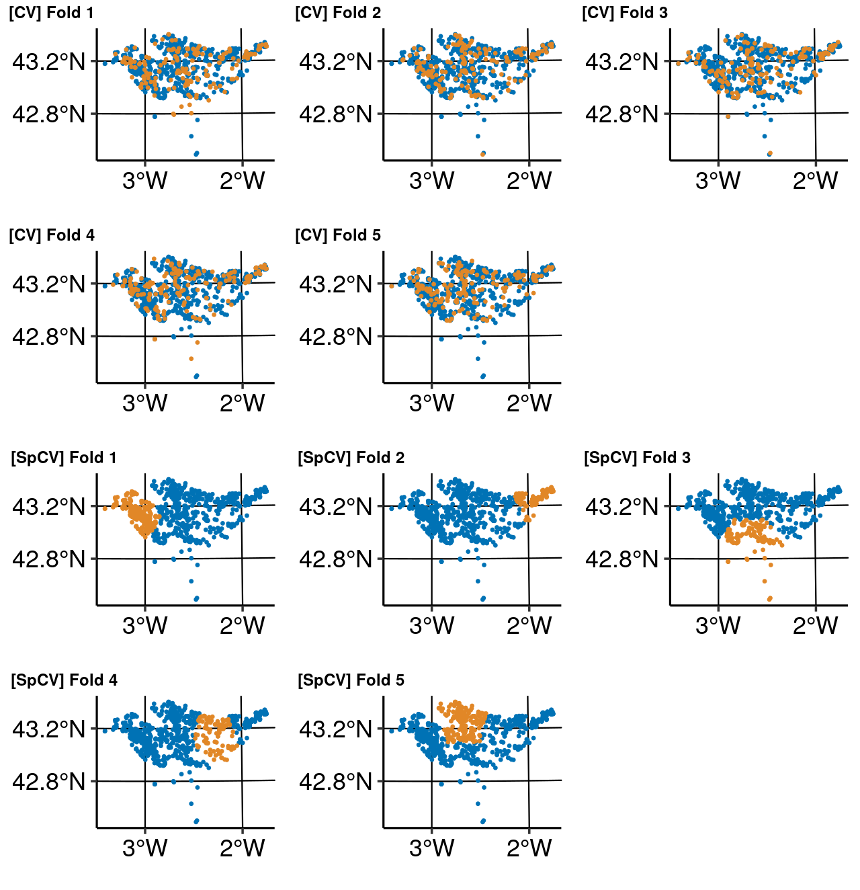

```r
coordinates <- diplodia_data[, c("x", "y")]
diplodia_data$geometry <- NULL
diplodia_data$x = NULL
diplodia_data$y = NULL

task_spatial <- makeClassifTask(id = "pathogen_data", data = diplodia_data,
                                target = "diplo01", positive = "1",
                                coordinates = coordinates)

plist <- createSpatialResamplingPlots(task_spatial, list("CV" = bm_nsp_non_diplodia_glm$results$diplodia$classif.binomial,
                                                         "SpCV" = bm_sp_non_diplodia_glm$results$diplodia$classif.binomial),
                                      crs = 32630, repetitions = 1, point.size = 1.5,
                                      y.axis.breaks = c(42.8, 43.2),
                                      x.axis.breaks = c(-2, -3),
                                      axis.text.size = 18)

sp <- plot_grid(plist[["Plots"]][[1]], plist[["Plots"]][[2]],
                plist[["Plots"]][[3]], ncol = 3, nrow = 1,
                labels = plist[["Labels"]][1:3], label_size = 18)
sp2 <- plot_grid(plist[["Plots"]][[4]], plist[["Plots"]][[5]], NULL,
                 ncol = 3, nrow = 1, labels = plist[["Labels"]][4:5],
                 label_size = 18)

nsp <- plot_grid(plist[["Plots"]][[6]], plist[["Plots"]][[7]],
                 plist[["Plots"]][[8]], ncol = 3, nrow = 1,
                 labels = plist[["Labels"]][6:8],
                 label_size = 18)
nsp2 <- plot_grid(plist[["Plots"]][[9]], plist[["Plots"]][[10]], NULL,
                  ncol = 3, nrow = 1, labels = plist[["Labels"]][9:10],
                  label_size = 18)
```


```r
plot_grid(sp, sp2, nsp, nsp2, ncol = 1)
```

```
## Warning in grid.Call(C_textBounds, as.graphicsAnnot(x$label), x$x, x$y, :
## font family 'Roboto Condensed' not found in PostScript font database

## Warning in grid.Call(C_textBounds, as.graphicsAnnot(x$label), x$x, x$y, :
## font family 'Roboto Condensed' not found in PostScript font database

## Warning in grid.Call(C_textBounds, as.graphicsAnnot(x$label), x$x, x$y, :
## font family 'Roboto Condensed' not found in PostScript font database

## Warning in grid.Call(C_textBounds, as.graphicsAnnot(x$label), x$x, x$y, :
## font family 'Roboto Condensed' not found in PostScript font database

## Warning in grid.Call(C_textBounds, as.graphicsAnnot(x$label), x$x, x$y, :
## font family 'Roboto Condensed' not found in PostScript font database

## Warning in grid.Call(C_textBounds, as.graphicsAnnot(x$label), x$x, x$y, :
## font family 'Roboto Condensed' not found in PostScript font database
```

```
## Warning in grid.Call(C_textBounds, as.graphicsAnnot(x$label), x$x, x$y, :
## font CMap for family 'Roboto Condensed' not found in font database
```

```
## Error in grid.Call(C_textBounds, as.graphicsAnnot(x$label), x$x, x$y, : failed to find or load PDF CID font
```


